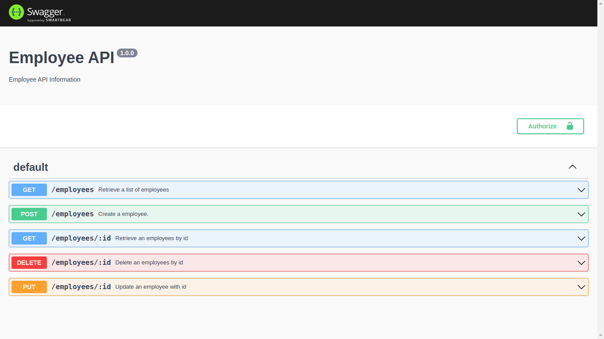
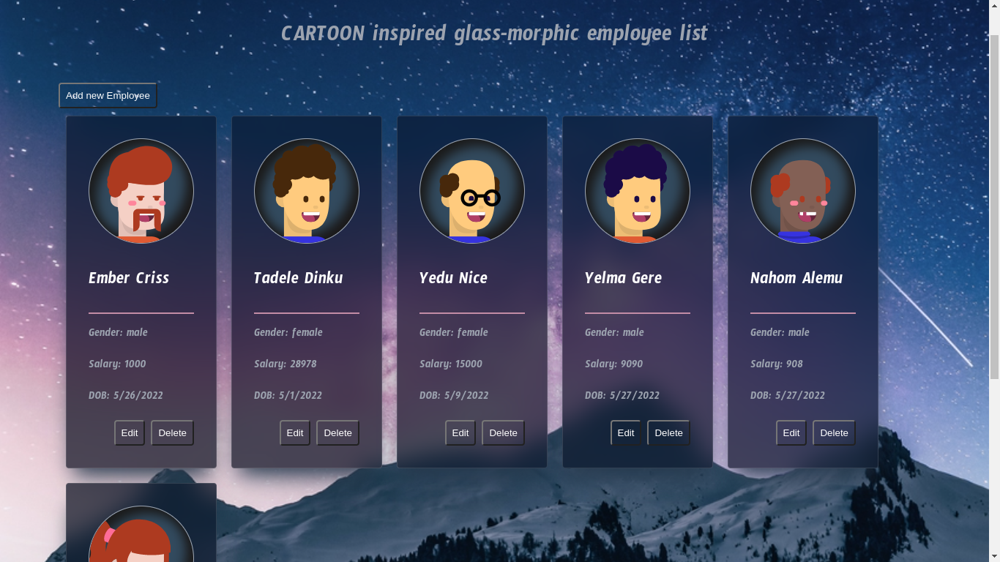

# Addis-software-task

## How to test the project
### Backend
The Backedn uses docker thus it will be simple, 
- create .env file with a mongodb database connection string
- <code>docker build . -t username/employee-back-end</code>
- <code>docker run -p 8080:8080 -d username/employee-back-end</code>
- open up a browser, <a href="localhost:8080">localhost:8080</a> and you will see an API documentation, on how to access the project
- 
#### Backedn featured
  - MVC architecture
  - Swagger API documentation
  
## Front-end
the front-end is a React project, follow the following setup
  - <code>npm install & npm run start</code>
  - follow the page it opens in the browser, and you should see the following homepage.
  - 
#### Front-end techs used
  - React + typescript
  - Redux
  - React router
  - Styled components
  - ~~Redux Saga~~
